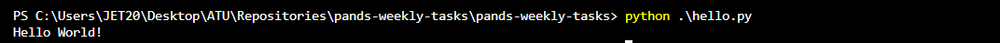
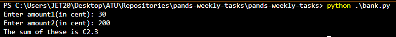
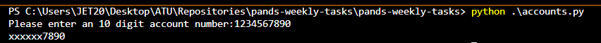
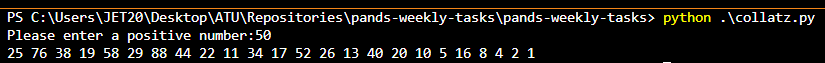
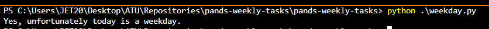
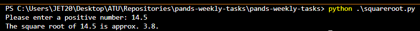
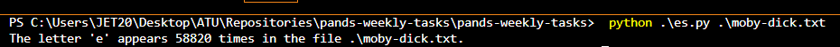
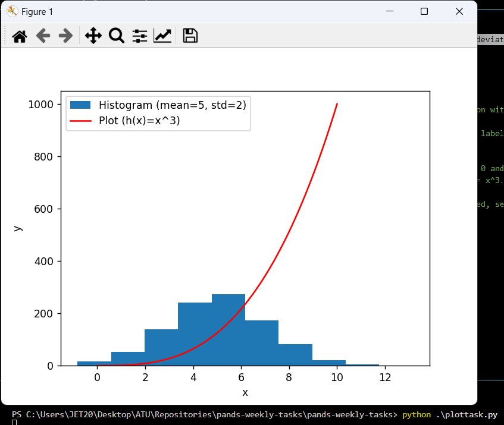

# Pands-Weekly-Tasks
***
Author: Galal Abdelaziz

Pands weekly tasks are part of the __Programming and Scripting__ module in Summer 2023/2024, at [ATU](https://www.atu.ie/).

***

## Technologies:

* Python 3.11.5 available [here](https://www.anaconda.com/download)
* Visual Studio Code available [here](https://code.visualstudio.com/)

***

## Tasks:

### __Weekly task 01:__    

* Name: hello.py

* Description: Create a python program that displays Hello World! when it is run.

* Terminal Demo Run:

* Resources: weekly lectures

***

### __Weekly task 02:__

* Name: bank.py

* Description: This program is to sum two amounts(in Cents) entered by the user, and print out the result in Euros.

* Terminal Demo Run:

* Resources: weekly lectures ; [Link 1](https://www.w3schools.com/python/python_howto_add_two_numbers.asp)

***

### __Weekly task 03:__

* Name: accounts.py

* Description: This program reads a 10 digits account number and outputs the account number with only the last 4 digits showing.

* Terminal Demo Run:

* Resources: weekly lectures ; [Link 1](https://stackoverflow.com/questions/9730653/is-there-a-better-way-to-mask-a-credit-card-number-in-python) ; [Link 2](https://realpython.com/len-python-function/#:~:text=The%20function%20len()%20is,with%20many%20different%20data%20types)

***

### __Weekly task 04:__

* Name: collatz.py

* Description: This program asks the user to input any positive integer and outputs the successive values of the Collatz conjecture.

* Terminal Demo Run:

* Resources: weekly lectures ; [Link 1](https://www.youtube.com/watch?v=6iF8Xb7Z3wQ) ; [Link 2](https://www.youtube.com/watch?v=DZwmZ8Usvnk)

***

### __Weekly task 05:__

* Name: weekday.py

* Description: This program outputs whether or not today is a weekday.

* Terminal Demo Run:

* Resources: weekly lectures ; [Link 1](https://docs.python.org/3/library/datetime.html#datetime.date.weekday) ; [Link 2](https://www.shecodes.io/athena/10185-how-to-check-what-day-of-the-week-it-is-in-python#:~:text=date%20using%20datetime.-,datetime.,)

***

### __Weekly task 06:__

* Name: squareroot.py

* Description: This program takes a positive floating-point number as input and outputs an approximation of its square root using Newton's method.

* Terminal Demo Run:

* Resources: weekly lectures ; [Link 1](https://www.geeksforgeeks.org/find-root-of-a-number-using-newtons-method/) ; [Link 2](https://runestone.academy/ns/books/published/thinkcspy/MoreAboutIteration/NewtonsMethod.html) ; [Link 3](https://www.toppr.com/guides/python-guide/examples/python-examples/functions/power-anonymous/python-program-display-powers-2-using-anonymous-function/#:~:text=Note%20that%20the%20operator%20that,powers%20of%20two%20as%20well) ; [Link 4](https://stackoverflow.com/questions/25254868/how-can-i-stop-printing-a-float-3-spaces-after-decimal) ; [Link 5](https://en.wikipedia.org/wiki/Newton%27s_method)

***

### __Weekly task 07:__

* Name: es.py

* Extra (test file): moby-dick.txt 

* Description: This program reads in a text file from an argument on the command line and outputs the number of e's it contains.

* Terminal Demo Run:

* Resources: weekly lectures ; [Link 1](https://docs.python.org/3/library/argparse.html) ; [Link 2](https://docs.python.org/3/tutorial/inputoutput.html#reading-and-writing-files) ; [Link 3](https://docs.python.org/3/library/stdtypes.html#string-methods) ; [Link 4](https://docs.python.org/3/library/os.path.html) ; [Link 5](https://realpython.com/python-main-function/)

***

### __Weekly task 08:__

* Name: plottask.py

* Description: This code generates a histogram of a normal distribution with a mean of 5 and a standard deviation of 2, and plots the function h(x) = x^3 in the range [0, 10] on the same set of axes.

* Terminal Demo Run:

* Resources: weekly lectures ; [Link 1](https://www.w3schools.com/python/matplotlib_histograms.asp) ; [Link 2](https://www.w3schools.com/python/matplotlib_plotting.asp) ; [Link 3](https://www.w3schools.com/python/numpy/numpy_random_normal.asp) ; [Link 4](https://www.w3schools.com/python/numpy/numpy_creating_arrays.asp)

***

## Notes:

* Throughout the course, tasks underwent several revisions to enhance and refine the code.
* The creation of all tasks involved integrating information from various resources and weekly lectures.
* As per instructions, extensive comments were added, providing explanations for nearly each line of code.
* The final major update to all tasks included the implementation of error handling, while preserving the original code as comments for reference.
    * Error handling resources: [Link 1](https://docs.python.org/3/tutorial/errors.html) ; [Link 2](https://docs.python.org/3/tutorial/errors.html#handling-exceptions) ; [Link 3](https://stackoverflow.com/questions/4592162/python-exception-handling) ; [Link 4](https://realpython.com/python-exceptions/)

***
## End